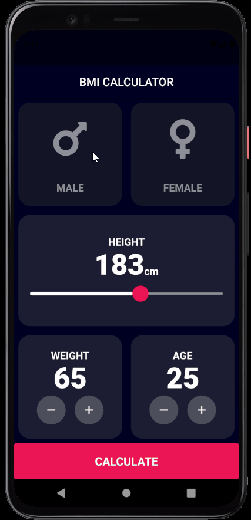

# BMI App - [](https://flutter.dev/)

<h1 align="center">
  
  <p>⚖️Calculate your BMI using this App⚖️</p>
  
</h1>

# Features

- Main page with selectables:
  - Gender
  - Height (in a slides)
  - Weight
  - Age
- Result page calculating the BMI using just weight and height

## Getting Started

- Clone the repository
- run in cmd:
  ```cmd
  flutter pub get
  flutter run
  ```

## Dependencieis

| Lib                  | Link                                                           |
| -------------------- | -------------------------------------------------------------- |
| Font Awesome Flutter | [Awesome icons](https://pub.dev/packages/font_awesome_flutter) |

## Device

- Tested in Pixel 4 - Android 11
